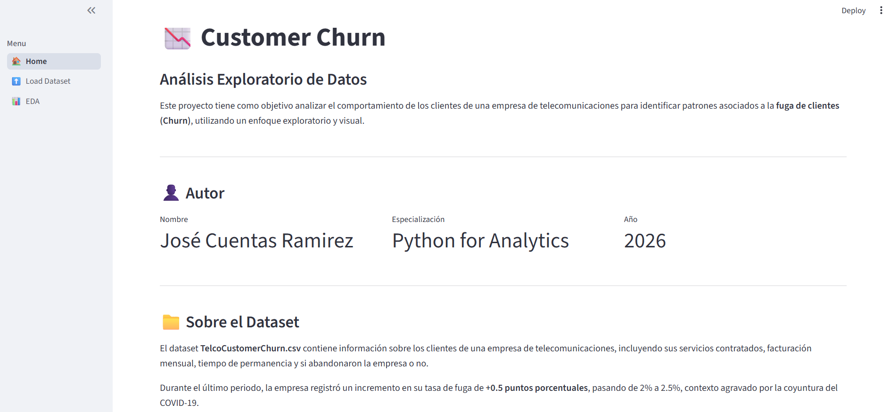
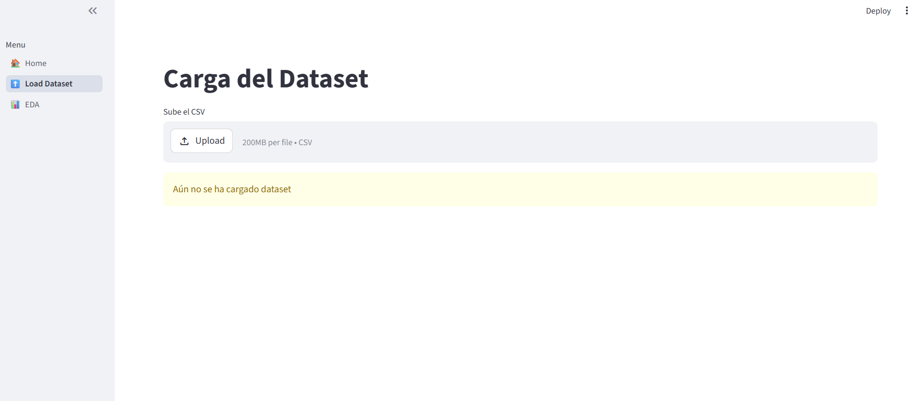
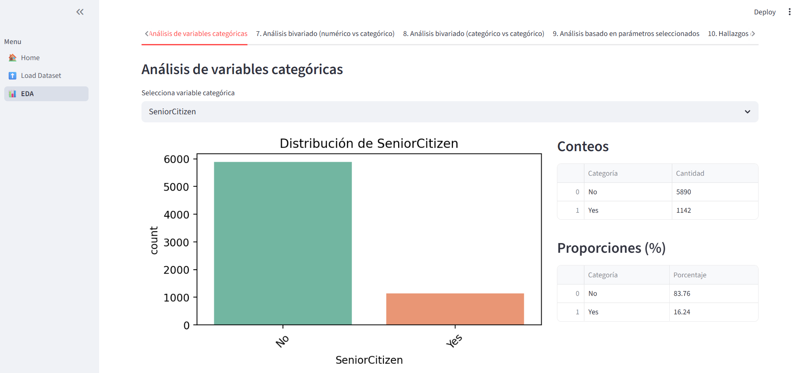
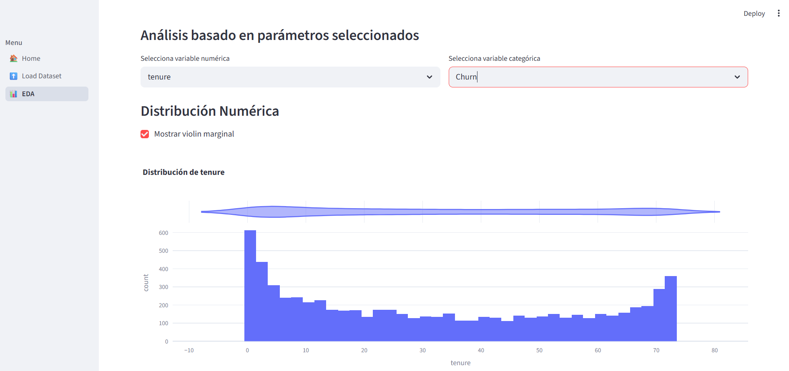
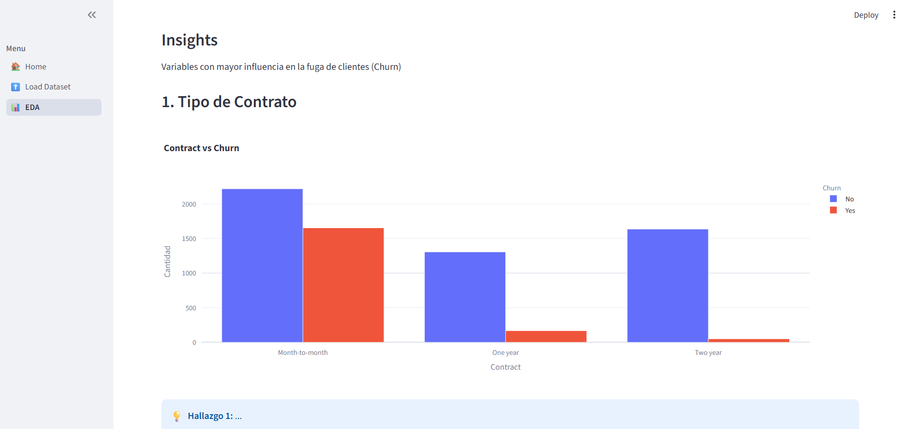

# 📊 Telco Customer Churn — Análisis Exploratorio de Datos

[](https://data-analyst-portfolio-kztcpuznphcx98pcstm3p5-jccr.streamlit.app/)
[](https://github.com/restjcr/data-analyst-portfolio)
[](https://www.python.org/)

---

## 🧠 Descripción del Proyecto

Aplicación interactiva desarrollada con **Streamlit** para el Análisis Exploratorio de Datos (EDA) del dataset **TelcoCustomerChurn**, orientada a identificar patrones asociados a la fuga de clientes en una empresa de telecomunicaciones.

> ⚠️ El objetivo **no es construir modelos predictivos**, sino explorar, limpiar, visualizar y extraer insights accionables que apoyen la toma de decisiones empresariales.

---

## 🎯 Objetivo del Análisis

Durante el último periodo, la empresa registró un incremento en su tasa de churn de **+0.5 puntos porcentuales** (de 2% a 2.5%), agravado por la coyuntura del COVID-19. Dado que adquirir un nuevo cliente cuesta entre **6 y 7 veces más** que retener uno existente, es vital comprender qué factores están asociados a la fuga.

---

## 📸 Screenshots







---

## 🗂️ Estructura del Proyecto

```
data-analyst-portfolio/
│
├── app.py                      # Punto de entrada principal
├── requirements.txt            # Dependencias del proyecto
├── README.md                   # Este archivo
│
├── pages/
│   ├── 0_home.py               # Landing
│   ├── 1_upload.py             # Carga de archivo plano
│   └── 2_eda.py                # Análisis Exploratorio de los datos
│
├── data/
│   └── TelcoCustomerChurn.csv  # Dataset
│
└── utils/
    └── analyzer.py             # Clase DataAnalyzer (POO)
```

---

## 📦 Módulos de la Aplicación

| Módulo | Descripción |
|--------|-------------|
| 🏠 **Home** | Presentación del proyecto, autor y tecnologías |
| 📂 **Carga del Dataset** | Carga interactiva vía `st.file_uploader()` |
| 🔍 **EDA** | 10 ítems de análisis exploratorio organizados en tabs |

### Ítems del EDA

1. Información general del dataset
2. Clasificación de variables
3. Estadísticas descriptivas
4. Análisis de valores faltantes
5. Distribución de variables numéricas
6. Análisis de variables categóricas
7. Análisis bivariado — numérico vs categórico
8. Análisis bivariado — categórico vs categórico
9. Análisis dinámico basado en parámetros seleccionados
10. 🔑 Hallazgos clave

---

## 🛠️ Tecnologías Utilizadas


---

## 🚀 Instrucciones de Ejecución

### 1. Clona el repositorio

```bash
git clone https://github.com/restjcr/data-analyst-portfolio.git
cd data-analyst-portfolio
```

### 2. Instala las dependencias

```bash
pip install -r requirements.txt
```

### 3. Ejecuta la aplicación

```bash
streamlit run app.py
```

### 4. Carga el dataset

En el módulo **"Carga del Dataset"**, sube el archivo `TelcoCustomerChurn.csv` usando el uploader interactivo.

---

## 🔑 Hallazgos Principales

| # | Variable | Insight |
|---|----------|---------|
| 1 | **Contract** | Los contratos mes a mes concentran la mayor tasa de churn |
| 2 | **tenure** | Los clientes con menor permanencia tienen mayor probabilidad de fuga |
| 3 | **MonthlyCharges** | Los clientes que abandonan pagan cargos mensuales más altos |
| 4 | **InternetService** | La fibra óptica presenta la mayor tasa de churn |
| 5 | **TechSupport** | Los clientes sin soporte técnico fugan más |

---

## 👤 Autor

**José Cuentas Ramirez**  
Especialización en Python for Analytics — 2026

[](https://www.linkedin.com/in/josecuentas/)

---

## 🌐 Links

- 🔴 **App en vivo:** [streamlit.app](https://data-analyst-portfolio-kztcpuznphcx98pcstm3p5-jccr.streamlit.app/)
- 💻 **Repositorio:** [github.com/restjcr](https://github.com/restjcr/data-analyst-portfolio)
